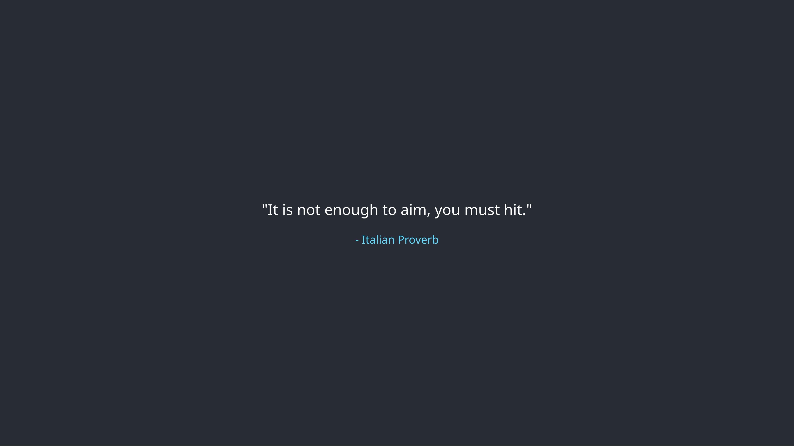

# Random Quotes App using vanilla JavaScript

This is a Random Quotes App using vanilla JavaScript. It fetches a quote on every page load and displays it on the screen.



## How to run

```
git clone https://github.com/saadfrhan/random-quotes-js
cd random-quotes-js
pnpm i
pnpm dev
```

Now open your browser and go to `http://localhost:5173`.